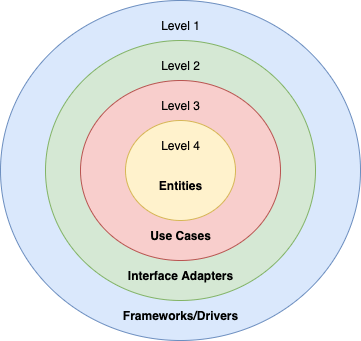

# ASAPP Chat Backend Challenge v1
## Overview
This is a java based boilerplate which runs an HTTP Server configured to answer the endpoints defined in 
[the challenge you received](https://backend-challenge.asapp.engineering/).

The solution was architectured following the [Clean Architecture Principles](https://blog.cleancoder.com/uncle-bob/2012/08/13/the-clean-architecture.html) of Robert C. Martin. The clean architecture compiles many code designs and principles, like SOLID, stable abstractions, and others. But, the core idea is to divide the system into levels (or layers) based on the business value. Hence, the highest level has business rules, with each lower one getting closer to the I/O devices.



## How to run it
It is possible to run it using gradle (but Db should be started separately with the model of section "Database structure") using:
```
./gradlew run
```

## Docker run
First it is necessary to build the image using:
```
docker build -t chat_app .
```

Finally, run the container:
```
docker run -d -p 8080:8080 -v /Users/Shared/ChatApp/dbfolder:/app/db/storage/ chat_app
```

Now a post to the endpoint `http://localhost:8080/check` should return a 200 OK response!

## Kubernetes run
Locally, a Kubernetes server must be started. Minikube is a good alternative:

```
minikube start
```

The minikube node uses its own Docker repository that’s not connected to the Docker registry on the local machine, so without pulling, it doesn’t know where to get the image from.
To fix this, point your shell to minikube’s docker-daemon, running:

```
eval $(minikube -p minikube docker-env)
```

One thing to note is that the command `eval $(minikube -p minikube docker-env)` has to be run in every new terminal window before you build an image. An alternative would be to put it into your .profile file.

Now rebuild the image once again, so that it’s installed in the minikube registry, instead of the local one:

```
docker build -t chat_app .
```

Proceed to create the kubernetes job:

```
kubectl apply -f kubernetes.yaml
```

Finally, Services of type LoadBalancer (like the one this project is using) can be exposed via the `minikube tunnel` command. It must be run in a separate terminal window to keep it running. This is not needed when the deployment is done on a cloud platform like AWS since those can provide external IPs to the pods. 

Now a post to the endpoint `http://localhost:8080/check` should return a 200 OK response!

## Local Debugging
For local debugging it is necesary to previously create the database in SQLite. To do so from a terminal you just have to run:
```
sqlite3 /db/chatapp.db
```
And once inside the sqlite3 running the initdb script provided will create the tables:
```
.read /db/initdb.sql
```
Or, in one line:
```
sqlite3 /db/chatapp.db < /db/initdb.sql
```
Postman collection and environment are included in the /Postman directory of the project, ready to perform calls to every endpoint.

## Authentication
Users can access the /user endpoint to register themselves and then use /login to validate their identity. To further use the endpoints of the application and be able to end and retrieve messages they will have to login and use the JWT token provided in the process as proof of their identity. This token has an expiration time of 10 minutes, after that it has to be requested again by reloging.

## Database structure


|  | Users           |   |
| ------------- |:-------------:| -----:|
|   id (PK)	 |  username    | password|


|        |            |  Messages |     |     |     |
| ------------- |:-------------:| -----:| -----:| -----:| -----:|
| id (PK)      | sender (FK) | receiver (FK) | contentType | content | timestamp |

## Future lines of work

- Followings the guidelines of the Spark documentation, unit tests of controllers is not implemented. End to end testing can be added for this ones.
- Since swagger does not yet provide out of the box support for Spark, implementing it would require refactoring efforts using a third party library.
- Database can be separated in a different container and bring both up using a Docker compose file, reducing the coupling of the infrastructure. 
- Logging functionality (not added to this version due to time constraints).